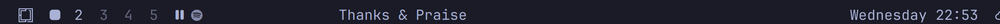
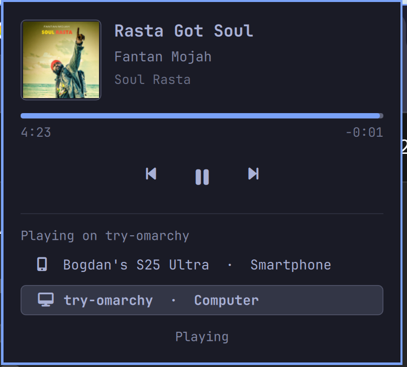

# Omarchy Spotify Mini Player

A bar widget for [Omarchy](https://omarchy.org) that shows the currently
playing track from your Spotify account and lets you control playback —
**on any device** connected to your account via Spotify Connect (your phone,
another computer, a smart speaker, ...), not just the local machine.

It uses the Spotify Web API, so it works even when nothing is playing
locally.





## Features

- Scrolling "song · artist" label in the bar
- Popup with album art, progress bar and ⏮ ⏯ ⏭ controls
- Controls the active Spotify Connect device, wherever it is
- Device picker: see which device is playing and switch playback between
  your devices (phone, computer, speaker, ...)
- Bar gestures:
  - **Left click** — play / pause
  - **Right click** — open popup
  - **Middle click** — next track
  - **Scroll up / down** — previous / next track
- Hides itself when nothing is playing

## Requirements

- Omarchy (with the Quickshell-based `omarchy-shell`)
- `curl`, `jq`, `python3` (all preinstalled on Omarchy)
- A free [Spotify Developer](https://developer.spotify.com/dashboard) app
  (one-time, ~2 minutes)

## Install

```bash
omarchy plugin add https://github.com/nichovski/omarchy-spotify.git --enable
```

## Connect your Spotify account

After installing, run the setup script once:

```bash
python3 ~/.config/omarchy/plugins/nichovski.spotify/setup.py
```

It will guide you through:

1. Creating an app at <https://developer.spotify.com/dashboard>
   (any name/description; check the **Web API** checkbox)
2. Registering `https://example.com/callback` as the Redirect URI
3. Authorizing the app with your Spotify account, then pasting the
   redirect URL (which contains the auth code) back into the terminal

Credentials are stored locally in
`~/.config/omarchy/spotify/credentials.env` (chmod 600) and never leave
your machine except to talk to `accounts.spotify.com` and
`api.spotify.com`.

Start playing music on any device with your account and the widget appears
in the bar.

## How it works

- `setup.py` — OAuth2 (PKCE) flow; stores a refresh token
- `fetch.sh` — refreshes the access token, polls
  `/v1/me/player/currently-playing` and writes
  `~/.config/omarchy/spotify/now_playing.json`
- `control.sh` — sends play/pause/next/previous to `/v1/me/player/*`
- `BarWidget.qml` — the bar widget; polls every 5 s while playing,
  15 s while idle

## Uninstall

```bash
omarchy plugin remove nichovski.spotify
rm -rf ~/.config/omarchy/spotify   # optional: removes stored credentials
```

## License

MIT
